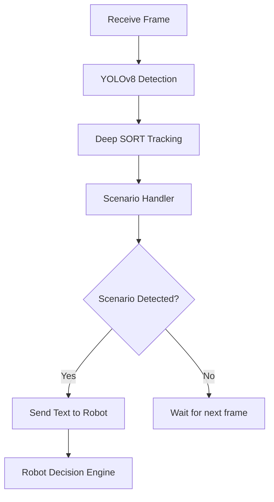

# TEMI Cognitive Companion – Real-Time Scenario Recognition System

🧠 A real-time backend system that empowers the TEMI robot to guide cognitively impaired users through everyday tasks by analyzing live video streams and detecting contextual scenarios.

---

## 🔍 Project Overview

This project implements an intelligent backend service for the **TEMI robot**, aimed at assisting users with cognitive difficulties during daily activities in the kitchen.  
The system receives live image frames from TEMI, runs object detection (YOLOv8), motion tracking (Deep SORT), and applies a **Scenario Engine** that determines user intent and safety context.

---

## 🎯 Key Capabilities

- ✅ Real-time object detection (plates, pots, microwave, cutlery, hands, etc.)
- ✅ Temporal reasoning over object presence across multiple frames
- ✅ Motion tracking per object using Deep SORT
- ✅ Scenario-based analysis: pouring food, using cutlery, interacting with microwave
- ✅ Emergency detection (e.g., metal pot placed in microwave)
- ✅ Speech guidance for users based on recognized scenarios

---

## ⚙️ Core Technologies

| Component              | Technology                     |
|------------------------|---------------------------------|
| Backend Framework      | FastAPI (Python)               |
| Object Detection       | YOLOv8                         |
| Object Tracking        | Deep SORT                      |
| Communication          | WebSocket, MQTT (optional)     |
| Scenario Logic         | Custom engine (Python class)   |
| Speech Output (robot)  | TEMI SDK or TTS via API        |

---

## 🧠 Custom Model Training

This project includes a **custom-trained YOLOv8 model** that was specifically trained to recognize objects and situations relevant to the scenario of heating food safely in a home kitchen environment.

### 📸 Data Collection

- Images were captured directly using the **TEMI robot’s camera** in real-world settings.
- Multiple objects were included: **metal pots, plastic/glass plates, microwave (open/closed), cutlery, and more**.
- Environmental diversity was maintained (different angles, lighting conditions, distances).

### 🏷️ Labeling & Dataset

- All images were uploaded and labeled using **[Roboflow](https://roboflow.com/)**.
- Labels used include: `pot`, `metal_pot`, `Plate`, `Bowl`, `open microwave`, `closed microwave`, `cutlery`, `person`, etc.
- The dataset was split into **training and validation sets** for proper evaluation.

### 🧪 Training

- The model was trained using the [Ultralytics YOLOv8 framework](https://docs.ultralytics.com).
- Custom training script included: [`src/model_train/train.py`](src/model_train/train.py)
- Trained weights saved in: `src/model_train/yolo_custom_training/weights/best.pt` (excluded from repo)
- Training ran for **50 epochs** with data augmentation and fine-tuning.

> The model was optimized to detect risky or assistive kitchen behaviors with high accuracy and low latency.

---

## 🧠 Scenario Engine: How It Works

The `ScenarioHandler` class is the brain of the system.  
It combines:

- 🔄 **Label history** tracking (what objects were seen over time)
- 🧍 **Motion detection** per object (via position deltas of tracked IDs)
- ⏱ **Cooldowns** to prevent repeating scenarios too often
- 📦 **Prioritized scenario evaluation**, including:
  - `metal_pot_in_microwave`: safety hazard (always prioritized)
  - `pouring_food`: pot and plate appear simultaneously
  - `plate_removed_from_microwave`: object disappears while door is open
  - `cutlery_used`: detected + in motion
  - `person_interacts`: person detected and moving

If a scenario is detected and cleared by cooldown logic, it is **returned to the client as a JSON** with optional incident ID.

Example output:
```json
{
  "scenario": "pouring_food",
  "timestamp": 1718700000.123,
  "incident_id": null
}
```

### 🏅 Scoring Mechanism

Each scenario is mapped to a predefined step.  
When the correct scenario is detected, the robot proceeds and awards points.  
Incorrect or unsafe actions result in warnings or repeat steps.


### 🧪 Example Use Case: Heating Food Safely

1. User opens microwave  
2. System checks for presence of metal pots  
3. User inserts plate → scenario: `plate_inserted_into_microwave`  
4. Robot speaks: "Close the microwave when you're ready."  
5. If dangerous behavior is detected (e.g., metal pot in microwave) → robot warns the user

🏗 Project Structure
```
src/
├── routes/                  # WebSocket handler
├── services/
│   ├── yolo_service.py      # YOLO object detection logic
│   └── moon_service.py      # Optional MoonDream API interface
├── utils/
│   └── scenario_handler.py  # ScenarioEngine logic
├── model_train/             # Custom YOLO training scripts
main.py                      # FastAPI entrypoint
.gitignore
requirements.txt
README.md

```
## 📖 User Manual (Operation Guide)

### 🔧 Installation

```bash
# 1. Clone the repository and enter the folder
git clone https://github.com/IdanVahab/TEMI_Server.git
cd TEMI_Server

# 2. (Optional) Create a virtual environment
python -m venv venv
source venv/bin/activate  # Windows: venv\Scripts\activate

# 3. Install dependencies
pip install -r requirements.txt
```
Python 3.8 is required

🚀 Running the Server
```
uvicorn main:app --reload
The server will open a WebSocket endpoint at:
📡 ws://localhost:8000/ws
```

Send base64-encoded images from the robot’s camera to this WebSocket.
The server will analyze the image and return one of:

A detected scenario (e.g., "pouring_food")

A MoonDream description (every 3 seconds, optional)

A fallback message such as "no_objects"

🔁 Client Side – Robot Decision Engine
On the Android client (TEMI robot), each scenario received from the server is evaluated by a Decision Engine:

If the scenario matches the current expected step → action is executed (speech, movement)

If not → the step is repeated until success

Each successful match gives points toward task completion.
See /docs/scenarios/heating_rice.md for a full step-by-step example.

📦 System Architecture (Backend Flow)



###📎 Notes
Model file moondream-0_5b-int8.mf is too large for GitHub (>600MB).
If using MoonDream, place this file manually in src/.

YOLO weights are ignored in .gitignore. Download or train using provided script.

👤 Author
Developed by Idan Vahab
As a final project in Machine Learning & Multimedia, under real clinical guidance.

🛡 License
Private academic project – for demonstration, research and evaluation purposes only.


